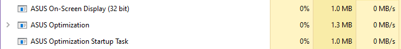

# ROGManager: A Replacement For Armoury Crate (mostly)

## Disclaimer

Your warranty is now void. Proceed at your own risk.

## Requirements

ROGManager requires "Asus Optimization" to be running as a Service, since "Asus Optimization" loads the `atkwmiacpi64.sys` driver and interpret ACPI events as key presses, and exposes a `\\.\ATKACPI` device to be used. "Asus Optimization" also notifies other processes via Messages (which ROGManager will receive). You do not need any other softwares from Asus to use ROGManager.




The OSD functionality is provided by `AsusOSD.exe`, which should also be under "Asus Optimization." 

```
PS C:\Windows\System32\DriverStore\FileRepository\asussci2.inf_amd64_b12b0d488bd75133\ASUSOptimization> dir


    Directory: C:\Windows\System32\DriverStore\FileRepository\asussci2.inf_amd64_b12b0d488bd75133\ASUSOptimization


Mode                 LastWriteTime         Length Name
----                 -------------         ------ ----
------         7/28/2020     02:41           3684 ASUS Optimization 36D18D69AFC3.xml
------         7/28/2020     02:52         218024 AsusHotkeyExec.exe
------         7/28/2020     02:52         273832 AsusOptimization.exe
------         7/28/2020     02:53         262056 AsusOptimizationStartupTask.exe
------         7/28/2020     02:53         117160 AsusOSD.exe
------         7/28/2020     02:53         844200 AsusSplendid.exe
------         7/28/2020     02:53         177576 AsusWiFiRangeboost.exe
------         7/28/2020     02:53         184744 AsusWiFiSmartConnect.exe
------         7/28/2020     02:53          44680 atkwmiacpi64.sys
------         7/28/2020     02:53         236952 CCTAdjust.dll
------         7/28/2020     02:53         204184 VideoEnhance_v406_20180511_x64.dll
```

## Remapping the ROG Key

By default, it will launch Task Manager when you press the ROG Key. You can compile your `.ahk` to `.exe` and run your macros.

To specify which program to launch, pass your path to the desired program as argument to `-rog`. For example:

```
.\ROGManager.exe -rog "Spotify.exe"
```

## Changing the Fan Curve

For the initial release, you have to change fan curve in `system\thermal\default.go`. In a future release ROGManager will allow you to specify the fan curve without rebuilding the binary. However, the default fan curve should be sufficient for most users.

Use the `Fn + F5` key combo to cycle through all the profiles. Fanless -> Quiet -> Slient -> High Performance

## How to Build

1. Install golang 1.14+ if you don't have it already
2. Install `rsrc`: `go get github.com/akavel/rsrc`
3. Generate `syso` file: `\path\to\rsrc.exe -manifest ROGKeyRebind.exe.manifest -ico go.ico -o ROGKeyRebind.exe.syso`
4. Build the binary: `go build -ldflags -H=windowsgui github.com/zllovesuki/ROGKeyRebind`

Recommend running ROGKeyRebind.exe on startup in Task Scheduler.

## Developing

Remove the `-ldflags -H=windowsgui` when you run or build, then you will see the console.

## CGo Optimizations

The usual default message loop includes calls to win32 API functions, which incurs a decent amount of runtime overhead coming from Go. As an alternative to this, you may compile ROGManager using an optional C implementation of the main message loop, by passing the `use_cgo` build tag. Note that the example build command requires WSL2:

```bash
GOOS=windows GOARCH=amd64 CGO_ENABLED=1 CC_FOR_TARGET=x86_64-w64-mingw32-gcc go build -ldflags="-H=windowsgui -s -w" github.com/zllovesuki/ROGManager
```

## Help Wanted

Asus wrote the `atkwmiacpi64.sys` with a very old version of Windows Driver Kit. If you are into reverse engineering and have knowledge of inner working of the ACPI programming, please help rewrite their driver to be more modern. Any decompiler/dissassembler (retdec and IDA Pro) should give you a good start.

Reference design:

Linux: [https://github.com/torvalds/linux/blob/master/drivers/platform/x86/asus-wmi.c](https://github.com/torvalds/linux/blob/master/drivers/platform/x86/asus-wmi.c)

macOS: [https://github.com/hieplpvip/AsusSMC](https://github.com/hieplpvip/AsusSMC)