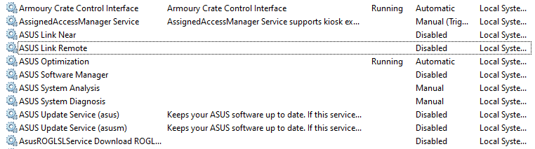

# G14Manager: An open source replacement to manage your G14

  [](https://godoc.org/github.com/zllovesuki/G14Manager)

## Disclaimer

Your warranty is now void. Proceed at your own risk.

## Current Status

Follow project status on [Sprint Board](https://github.com/zllovesuki/G14Manager/projects/1). This will include features in progress.

After some reverse engineering, G14Manager now (mostly) replaces Asus software suite's functionalities. Unimplemented functionalities are:
1. ~~Toggle mute/unmute microphone~~
2. ~~Toggle enable/disable TouchPad~~
3. ~~Keyboard brightness adjustment~~
4. ~~Fan curve control~~
4. On-screen display
5. AniMe Matrix control (Proof of Concept available)

_Note_: Currently, the default profiles expect Power Plans "High Performance" and "Power Saver" to be available. If your installation of Windows does not have those Power Plans, G14Manager will refuse to start. This will be fixed when customizable config is released.

## Bug Report

If your encounter an issue with using G14Manager (e.g. does not start, functionalities not working, etc), please download the debug build `G14Manager.debug.exe`, and run the binary in a Terminal with Administrator Privileges, then submit an issue with the full logs.

## Requirements

You must have a Zephyrus G14, and has Asus Optimization the driver (aka `atkwmiacpi64`) installed. You may check and see if `C:\Windows\System32\DriverStore\FileRepository\asussci2.inf_amd64_xxxxxxxxxxxxxxxx` exists. (I'm working toward removing this as a requirement.)

G14Manager is **not tested** on other Zephyrus laptops (e.g. G15). You are welcome to test G14Manager on laptops such as G15, however support will be limited, and all functionalities are not guaranteed to be working.

Verified compatible G14 variatns:
- GA401IV
- GA401IH

For other G14 variants, please submit an issue with your DSDT and SSDT table so I can verify that G14Manager will work on your variants.

Asus Optimization (the service) **cannot** be running, otherwise G14Manager and Asus Optimization will be fighting over control. We only need Asus Optimization (the driver) to be installed so Windows will load `atkwmiacpi64.sys`, and exposes a `\\.\ATKACPI` device to be used. (I'm working toward removing this as a requirement.)

You do not need any other softwares from Asus (e.g. Armoury Crate and its cousins, etc) running to use G14Manager; you can safely uninstall them from your system. However, some softwares (e.g. Asus Optimization) are installed as Windows Services, and you should disable them in Services as they do not provide any value:



### Technical Notes

"ASUS System Control Interface V2" exists as a placeholder so Asus Optimization can have a device "attached" to it, and loads `atkwmiacpi64.sys`. The hardware for ASCI is a stud in the DSDT table.

"Armoury Crate Control Interface" also exists as a placeholder (stud in the DSDT table), and I'm not sure what purpose does this serve. Strictly speaking, you may disable this in Device Manager and suffer no ill side effects.

Only two pieces of hardwares are useful for taking full control of your G14: "Microsoft ACPI-Compliant Embedded Controller" (this stores the configuration, including your fan curves), and "Microsoft Windows Management Interface for ACPI" (this interacts with the embedded controller in the firmware). Since they are ACPI functions, userspace applications cannot invoke those methods (unless we run WinRing0). Therefore, `atkwmiacpi64.sys` exists solely to create a kernel mode device (`\\.\ATKACPI`), and an userspace device (`\\DosDevices\ATKACPI`) so userspace applications and interface with the firmware (including controlling the fan curve, among other devious things).

---

Optionally, disable ASUS System Analysis Driver with `sc.exe config "ASUSSAIO" start=disabled` in a Terminal with Administrator privileges, if you do not plan to use MyASUS.

Recommend running `G14Manager.exe` on startup in Task Scheduler with "Run with highest privileges."

## Remapping Fn+Left/Right to PgUp/PgDown

Pass `-remap` flag to enable it. Note that this is done with ScanCode via `SendInput`. Some applications using DirectInput may not register the emulated keypress.

```
.\G14Manager.exe -remap
```

## Remapping the ROG Key

Use case: You can compile your `.ahk` to `.exe` and run your macros.

By default, it will launch Task Manager when you press the ROG Key once.

To specify which program to launch when pressed multiple times, pass your path to the desired program as argument to `-rog` multiple times. For example:

```
.\G14Manager.exe -rog "Taskmgr.exe" -rog "start Spotify.exe"
```

This will launch Task Manager when you press the ROG key once, and Spotify when you press twice.

## Changing the Fan Curve

For the initial release, you have to change fan curve in `system\thermal\default.go`. In a future release G14Manager will allow you to specify the fan curve without rebuilding the binary. However, the default fan curve should be sufficient for most users.

Use the `Fn + F5` key combo to cycle through all the profiles. Fanless -> Quiet -> Slient -> Performance.

The key combo has a time delay. If you press the combo X times, it will apply the the next X profile. For example, if you are currently on "Fanless" profile, pressing `Fn + F5` twice will apply the "Slient" profile.

## Automatic Thermal Profile Switching

For the initial release, it is hardcoded to be:

- On power adapter plugged in: "Performance" Profile
- On power adapter unplugged: "Silent" Profile

There is a 5 seconds delay before changing the profile upon power source changes.

To enable this feature, pass `-autoThermal` flag to enable it:

```
.\G14Manager.exe -autoThermal
```

## Battery Charge Limit

By default, G14Manager will limit full charge to be 80%. This will be customizable in a later release.

## How to Build

1. Install golang 1.14+ if you don't have it already
2. Install mingw x86_64 for `gcc.exe`
2. Install `rsrc`: `go get github.com/akavel/rsrc`
3. Generate `syso` file: `\path\to\rsrc.exe -arch amd64 -manifest G14Manager.exe.manifest -ico go.ico -o G14Manager.exe.syso`
4. Build the binary: `.\scripts\build.ps1`

## Developing

Use `.\scripts\run.ps1`.

Most keycodes can be found in [reverse_eng/codes.txt](https://github.com/zllovesuki/reverse_engineering/blob/master/G14/codes.txt), and the repo contains USB and API calls captures for reference.

## References

- https://github.com/torvalds/linux/blob/master/drivers/platform/x86/asus-wmi.c
- https://github.com/torvalds/linux/blob/master/drivers/platform/x86/asus-nb-wmi.c
- https://github.com/torvalds/linux/blob/master/drivers/hid/hid-asus.c
- https://github.com/flukejones/rog-core/blob/master/kernel-patch/0001-HID-asus-add-support-for-ASUS-N-Key-keyboard-v5.8.patch
- https://github.com/rufferson/ashs
- https://code.woboq.org/linux/linux/include/linux/platform_data/x86/asus-wmi.h.html
- http://gauss.ececs.uc.edu/Courses/c4029/pdf/ACPI_6.0.pdf
- https://wiki.ubuntu.com/Kernel/Reference/WMI
- [DSDT Table](https://github.com/zllovesuki/reverse_engineering/blob/master/G14/g14-dsdt.dsl)
- [Reverse Engineering](https://github.com/zllovesuki/reverse_engineering/tree/master/G14)

## Credits

"Go" logo licensed under unsplash license: [https://blog.golang.org/go-brand](https://blog.golang.org/go-brand)

"Dead computer" logo licensed under Creative Commons: [https://thenounproject.com/term/dead-computer/98571/](https://thenounproject.com/term/dead-computer/98571/)